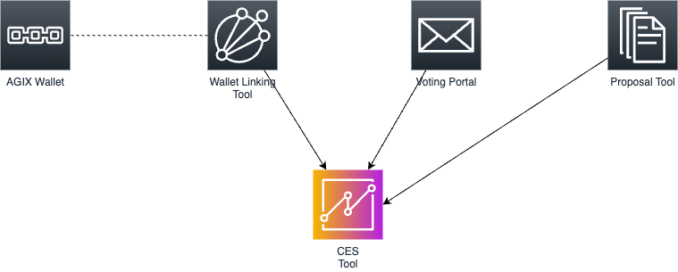
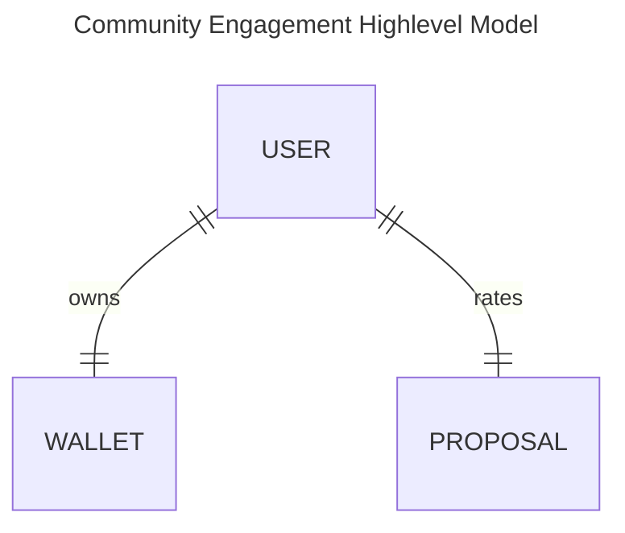
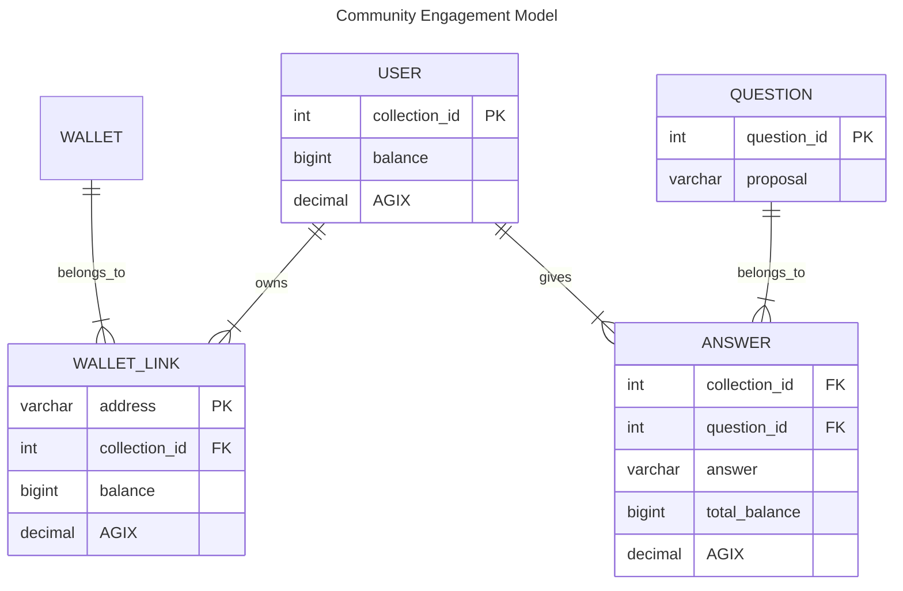

# Community Engagement Score

# Setup
* Install DuckDB `brew install duckdb`
* Start DuckDB with tables loaded `make db`
* Query data

# System Overview

    
    

        System context overview - <a target="__blank" href="docs/images/system_overview.drawio">source</a>
    

# Data Model
Data model using [Crow's_foot_notation](https://en.wikipedia.org/wiki/Entity%E2%80%93relationship_model#Crow's_foot_notation)

* **users.csv** (collections) - user in the voting portal
* **wallet-links.csv** - [join table] between user and wallet
* **answers.csv** (voting-portal) - [join table] contains answers (ratings) of questions
* **questions.csv** - proposal names

